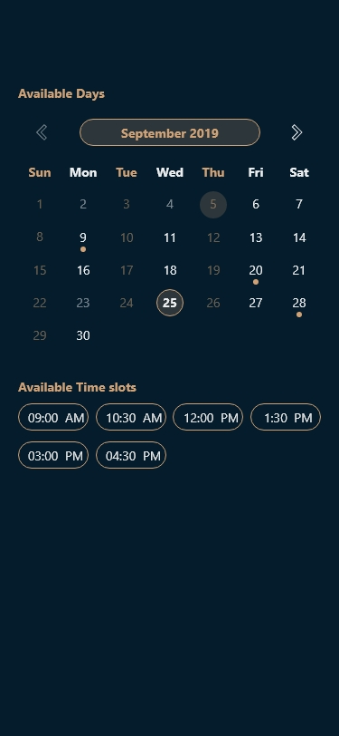

# CustomCalender
Custom Calender Component

### Screenshots:
&nbsp;
&nbsp;
&nbsp;
&nbsp; 

### Features:
- The users can set a max or/and min date.
- Each day can have one of three states: Open, Closed or Disabled
- Today’s date is remarked with special colored circle without border.
- The calendar should provide 2 change listeners: OnDateSelected, OnMonthChange
    a. The default month of the calendar is the current month.
    b. The OnDateSelected propagates the interaction by passing a calendar object representing the date selected.
    c. The OnMonthChange propagates the interaction with the backward and forward arrows of the month by
       passing an Integer object representing the year and an Integer object represents the month
- Days with events have a bottom dot
